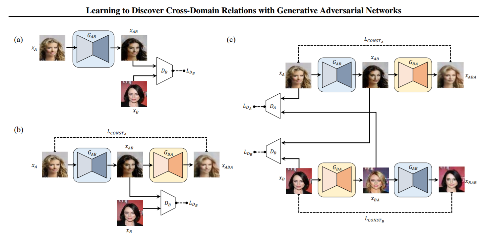

** 논문 Learning to Discover Cross-Domain Relations with Generative Adversarial Networks **

[LINK](https://arxiv.org/pdf/1703.05192.pdf).

## 논문 요약 

다른 두 도메인에서 관계를 찾는 것은 사람에게는 자연스러운 일이다. 예를 들어 영어와 이를 번역한 프랑스어의 관계를 인식하거나 바지나 신발과 같은 스타일의 수트 자켓을 고르기도 한다. 
과연 이러한 유사성에 대해 학습하는 능력을 가질 수 있을까의 문제는 특정 조건의 이미지의 생성 문제로 바꿔말할 수 있다. 또 바꿔 말하면 하나의 도메인과 다른 도메인의 매핑을 위한 함수를 찾는 문제로 생각할 수 있다.

GAN(Generative Adversarial network, 생성적 적대 신경망)의 최근 트레이닝 방식은 대부분 쌍을 이루는 명시적인 데이터를 사람이나 다른 알고리즘을 제공하는 방식으로 접근되고 있다.
이러한 명시적인 데이터는 라벨링 하는데에 많은 노동력을 필요로 할 수 있고 하나의 이미지안에 많은 베스트 후보군이 있어서 작업이 어려울 수 있다.

discoGAN은 두 가지 시각적 도메인이 명시적인 데이터 없이 관계를 발견해 낼 수 있도록 하고자 했다.

2014년 Goodfellow 의 Standard GAN 에서는 랜덤한 가우시안 노이즈 z 를 hidden features h 에 인코딩하고 MNIST와 같은 숫자 이미지를 생성하였으나 DiscoGAN에서는 노이즈 대신 이미지를 인풋값으로 사용하였다. 
그리고 기존에는 도메인A에서 B로의 매핑만 배울수 있는 구조였기 때문에 하나의 generator를 더 추가하였다. 

** 이미지 출처:  discoGAN 논문

<p align="center">
    
</p>

(a)는 Standard GAN인데 여기에서는 Generator 에서 dimensional noise vector를 추가하여 xAB라는 fake 이미지를 생성하고, 실제 이미지 xB와 함께 Discriminator 네트워크에서 판별에 들어간다. Discriminator에서 0~1사이의 진짜 일 확률을 리턴하고, 정답에 대한 피드백을 받는 동안, Generator는 Discriminator로 부터 생성모델에 대한 정확도를 피드백으로서 받는다.

(b)와 (a)의 차이는 (a)에서 xAB로 생성한 fake 이미지를 다시 원본 xA의 형태로 재구성하는 fake이미지 xABA를 만드는 generator를 추가했다는 점이고, xA와 xABA의 차이를 전체 loss에 더하여 준다. Consistency Loss or Reconstruction Loss라고 부른다. (Lconst A) 
이렇게 하면 gAB는 gABA로 돌아갈 방법을 고려하여야 하기 때문에 xAB를 함부로 생성하지 못하는 방향으로 학습하게 된다. 그 결과가 배경은 거의 변하지 않고 타겟으로하는 대상만 transfer되는 것으로 보여지게 되는 것이다.


(c)에서는 이제 완전한 discoGAN을 설명해 준다. 두개의 (b)가 있고 각각 A->B->A, B->A->B로 생성하는 것을 목표로하고 있다고 하자. 이 두모델을 동시에 
학습을 시킬때 discriminator에게는 항상 fake 이미지와 real 이미지가 전달 되어야 하는데 각 모델에서 생성한 fake이미지는 다른 모델의 Discriminator 네트워크의 인풋이 되어 각각의 Loss를 갖게 할 수 있을 것이다. 이를 통해 A->B->A 또는 B->A->B가 쌍을 이루어 안정적인 모델이 될 수 있다.
이때 최종 Loss = LganA + Lconst A + LganB + Lconst B 가 된다.


```python
// (c) 모델을 소스로 표현한 부분..
# Build and compile the discriminators
self.d_A = self.build_discriminator()
self.d_B = self.build_discriminator()
self.d_A.compile(loss='mse',
    optimizer=optimizer,
    metrics=['accuracy'])
self.d_B.compile(loss='mse',
    optimizer=optimizer,
    metrics=['accuracy'])

#-------------------------
# Construct Computational
#   Graph of Generators
#-------------------------

# Build the generators
self.g_AB = self.build_generator()
self.g_BA = self.build_generator()

# Input images from both domains
img_A = Input(shape=self.img_shape)
img_B = Input(shape=self.img_shape)

# Translate images to the other domain
fake_B = self.g_AB(img_A)
fake_A = self.g_BA(img_B)
# Translate images back to original domain
reconstr_A = self.g_BA(fake_B)
reconstr_B = self.g_AB(fake_A)

# For the combined model we will only train the generators
self.d_A.trainable = False
self.d_B.trainable = False

# Discriminators determines validity of translated images
valid_A = self.d_A(fake_A)
valid_B = self.d_B(fake_B)

# Objectives
# + Adversarial: Fool domain discriminators
# + Translation: Minimize MAE between e.g. fake B and true B
# + Cycle-consistency: Minimize MAE between reconstructed images and original
self.combined = Model(inputs=[img_A, img_B],
                      outputs=[ valid_A, valid_B,
                                fake_B, fake_A,
                                reconstr_A, reconstr_B ])
self.combined.compile(loss=['mse', 'mse',
                            'mae', 'mae',
                            'mae', 'mae'],
                      optimizer=optimizer)

```


_yay_

[back](./)
