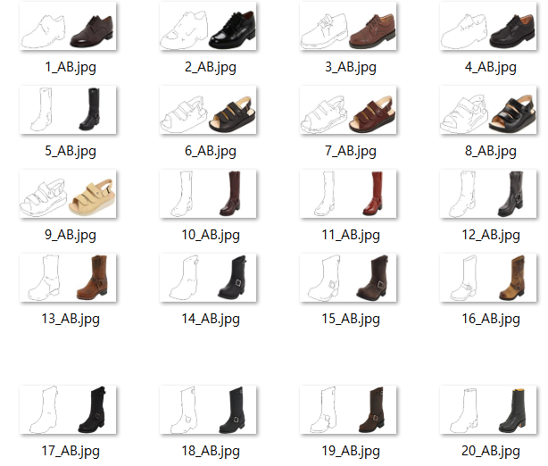
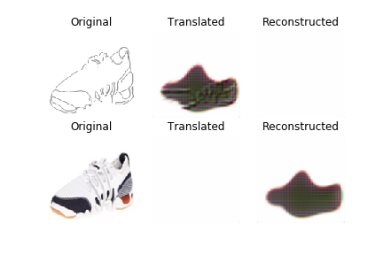
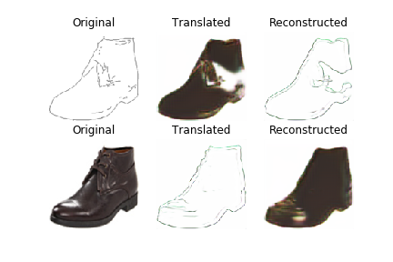

** 논문 Learning to Discover Cross-Domain Relations with Generative Adversarial Networks **

[Paper LINK](https://arxiv.org/pdf/1703.05192.pdf).

일단 gan을 공부하기 시작하면서 본 영상중에 가장 충격을 받았던 것은 오바마가 아니라 이것이었다.
CycleGAN과 DiscoGAN으로 나를 이끌어준 horse2zebra

<p align="center">
    
</p>


## 논문 요약 

다른 두 도메인에서 관계를 찾는 것은 사람에게는 자연스러운 일이다. 예를 들어 영어와 이를 번역한 프랑스어의 관계를 인식하거나 바지나 신발과 같은 스타일의 수트 자켓을 고르기도 한다. 
과연 이러한 유사성에 대해 학습하는 능력을 가질 수 있을까의 문제는 특정 조건의 이미지의 생성 문제로 바꿔말할 수 있다. 또 바꿔 말하면 하나의 도메인과 다른 도메인의 매핑을 위한 함수를 찾는 문제로 생각할 수 있다.

GAN(Generative Adversarial network, 생성적 적대 신경망)의 최근 트레이닝 방식은 대부분 쌍을 이루는 명시적인 데이터를 사람이나 다른 알고리즘을 제공하는 방식으로 접근되고 있다.
이러한 명시적인 데이터는 라벨링 하는데에 많은 노동력을 필요로 할 수 있고 하나의 이미지안에 많은 베스트 후보군이 있어서 작업이 어려울 수 있다.

discoGAN은 두 가지 시각적 도메인이 명시적인 데이터 없이 관계를 발견해 낼 수 있도록 하고자 했다.

2014년 Goodfellow 의 Standard GAN 에서는 랜덤한 가우시안 노이즈 z 를 hidden features h 에 인코딩하고 MNIST와 같은 숫자 이미지를 생성하였으나 DiscoGAN에서는 노이즈 대신 이미지를 인풋값으로 사용하였다. 
그리고 기존에는 도메인A에서 B로의 매핑만 배울수 있는 구조였기 때문에 하나의 generator를 더 추가하였다. 

<p align="center">
    
</p>

######  이미지 출처:  discoGAN 논문 

(a)는 Standard GAN인데 여기에서는 Generator 에서 dimensional noise vector를 추가하여 xAB라는 fake 이미지를 생성하고, 실제 이미지 xB와 함께 Discriminator 네트워크에서 판별에 들어간다. Discriminator에서 0~1사이의 진짜 일 확률을 리턴하고, 정답에 대한 피드백을 받는 동안, Generator는 Discriminator로 부터 생성모델에 대한 정확도를 피드백으로서 받는다.

(b)와 (a)의 차이는 (a)에서 xAB로 생성한 fake 이미지를 다시 원본 xA의 형태로 재구성하는 fake이미지 xABA를 만드는 generator를 추가했다는 점이고, xA와 xABA의 차이를 전체 loss에 더하여 준다. Consistency Loss or Reconstruction Loss라고 부른다. (Lconst A) 
이렇게 하면 gAB는 gABA로 돌아갈 방법을 고려하여야 하기 때문에 xAB를 함부로 생성하지 못하는 방향으로 학습하게 된다. 그 결과가 배경은 거의 변하지 않고 타겟으로하는 대상만 transfer되는 것으로 보여지게 되는 것이다.


(c)에서는 이제 완전한 discoGAN을 설명해 준다. 두개의 (b)가 있고 각각 A->B->A, B->A->B로 생성하는 것을 목표로하고 있다고 하자. 이 두모델을 동시에 
학습을 시킬때 discriminator에게는 항상 fake 이미지와 real 이미지가 전달 되어야 하는데 각 모델에서 생성한 fake이미지는 다른 모델의 Discriminator 네트워크의 인풋이 되어 각각의 Loss를 갖게 할 수 있을 것이다. 이를 통해 A->B->A 또는 B->A->B가 쌍을 이루어 안정적인 모델이 될 수 있다.
이때 최종 Loss = LganA + Lconst A + LganB + Lconst B 가 된다.


```python
class DiscoGAN():
    def __init__(self):
        # Input shape
        self.img_rows = 128
        self.img_cols = 128
        self.channels = 3
        self.img_shape = (self.img_rows, self.img_cols, self.channels)

        # Configure data loader
        self.dataset_name = 'edges2shoes'
        self.data_loader = DataLoader(dataset_name=self.dataset_name,
                                      img_res=(self.img_rows, self.img_cols))


        # Calculate output shape of D (PatchGAN)
        patch = int(self.img_rows / 2**4)
        self.disc_patch = (patch, patch, 1)

        # Number of filters in the first layer of G and D
        self.gf = 64
        self.df = 64

        optimizer = Adam(0.0002, 0.5)

        # Build and compile the discriminators
        self.d_A = self.build_discriminator()
        self.d_B = self.build_discriminator()
        self.d_A.compile(loss='mse',
            optimizer=optimizer,
            metrics=['accuracy'])
        self.d_B.compile(loss='mse',
            optimizer=optimizer,
            metrics=['accuracy'])

        #-------------------------
        # Construct Computational
        #   Graph of Generators
        #-------------------------

        // (c) 모델을 소스로 표현한 부분..
        # Build and compile the discriminators
        self.d_A = self.build_discriminator()
        self.d_B = self.build_discriminator()
        self.d_A.compile(loss='mse',
            optimizer=optimizer,
            metrics=['accuracy'])
        self.d_B.compile(loss='mse',
            optimizer=optimizer,
            metrics=['accuracy'])

        #-------------------------
        # Construct Computational
        #   Graph of Generators
        #-------------------------

        # Build the generators
        self.g_AB = self.build_generator()
        self.g_BA = self.build_generator()

        # Input images from both domains
        img_A = Input(shape=self.img_shape)
        img_B = Input(shape=self.img_shape)

        # Translate images to the other domain
        fake_B = self.g_AB(img_A)
        fake_A = self.g_BA(img_B)
        # Translate images back to original domain
        reconstr_A = self.g_BA(fake_B)
        reconstr_B = self.g_AB(fake_A)

        # For the combined model we will only train the generators
        self.d_A.trainable = False
        self.d_B.trainable = False

        # Discriminators determines validity of translated images
        valid_A = self.d_A(fake_A)
        valid_B = self.d_B(fake_B)

        # Objectives
        # + Adversarial: Fool domain discriminators
        # + Translation: Minimize MAE between e.g. fake B and true B
        # + Cycle-consistency: Minimize MAE between reconstructed images and original
        self.combined = Model(inputs=[img_A, img_B],
                              outputs=[ valid_A, valid_B,
                                        fake_B, fake_A,
                                        reconstr_A, reconstr_B ])
        self.combined.compile(loss=['mse', 'mse',
                                    'mae', 'mae',
                                    'mae', 'mae'],
                              optimizer=optimizer)

```

컴파일할때 나오는 mse, mae 는 손실함수 인데 자세한 것은 [블로그](http://www.engear.net/wp/tag/mse/)를 참조

각각의 Generator와 Discriminator는 이런 네트워크 모양을 띄고 있다고 한다. (출처: [Taeoh Kim github](https://github.com/taeoh-kim/Pytorch_DiscoGAN))

<p align="center">
    
    
</p>
    
이부분을 다시 예제에서 보면 
1. Generator

```python
    def build_generator(self):
        """U-Net Generator"""

        def conv2d(layer_input, filters, f_size=4, normalize=True):
            """Layers used during downsampling"""
            d = Conv2D(filters, kernel_size=f_size, strides=2, padding='same')(layer_input)
            d = LeakyReLU(alpha=0.2)(d)
            if normalize:
                d = InstanceNormalization()(d)
            return d

        def deconv2d(layer_input, skip_input, filters, f_size=4, dropout_rate=0):
            """Layers used during upsampling"""
            u = UpSampling2D(size=2)(layer_input)
            u = Conv2D(filters, kernel_size=f_size, strides=1, padding='same', activation='relu')(u)
            if dropout_rate:
                u = Dropout(dropout_rate)(u)
            u = InstanceNormalization()(u)
            u = Concatenate()([u, skip_input])
            return u

        # Image input
        d0 = Input(shape=self.img_shape)

        # Downsampling
        d1 = conv2d(d0, self.gf, normalize=False)
        d2 = conv2d(d1, self.gf*2)
        d3 = conv2d(d2, self.gf*4)
        d4 = conv2d(d3, self.gf*8)
        d5 = conv2d(d4, self.gf*8)
        d6 = conv2d(d5, self.gf*8)
        d7 = conv2d(d6, self.gf*8)

        # Upsampling
        u1 = deconv2d(d7, d6, self.gf*8)
        u2 = deconv2d(u1, d5, self.gf*8)
        u3 = deconv2d(u2, d4, self.gf*8)
        u4 = deconv2d(u3, d3, self.gf*4)
        u5 = deconv2d(u4, d2, self.gf*2)
        u6 = deconv2d(u5, d1, self.gf)

        u7 = UpSampling2D(size=2)(u6)
        output_img = Conv2D(self.channels, kernel_size=4, strides=1,
                            padding='same', activation='tanh')(u7)

        return Model(d0, output_img)

```

2. Discriminator

```python
    def build_discriminator(self):

        def d_layer(layer_input, filters, f_size=4, normalization=True):
            """Discriminator layer"""
            d = Conv2D(filters, kernel_size=f_size, strides=2, padding='same')(layer_input)
            d = LeakyReLU(alpha=0.2)(d)
            if normalization:
                d = InstanceNormalization()(d)
            return d

        img = Input(shape=self.img_shape)

        d1 = d_layer(img, self.df, normalization=False)
        d2 = d_layer(d1, self.df*2)
        d3 = d_layer(d2, self.df*4)
        d4 = d_layer(d3, self.df*8)

        validity = Conv2D(1, kernel_size=4, strides=1, padding='same')(d4)

        return Model(img, validity)

```

이 예제 소스로 우선 예제 중에 edges2shoes라는 것이 흥미로워서 실습을 진행해 보았다.
수많은 신발이미지와 이 신발의 edge를 pair로써 함께 제공하여 트레이닝을 하는 것으로 
맨처음에는 edge에 색상을 어떻게 입히는지 감도 못잡는 느낌이었는데 Iteration 5000 부근에서 
색상이 edge안에 가두어지는? 형태는 어쨋든 신발같은 느낌이 나기 시작했다.

시간이 워낙 많이 걸리기 때문에 여기까지만 하고 멈추었지만 계속 돌리면 될것 같다는 느낌은 들었다. 

[실습git](https://github.com/FullMooney/py_studies/blob/master/discogan/)

**input**
<p align="center">
    
</p>  

**iter 1000**
<p align="center">
    
</p>  

**iter 5000**
<p align="center">
    
</p>  


- 참고한 git
  - [discoGAN 논문을 쓴 SKTBrain의 github](https://github.com/SKTBrain/DiscoGAN) << respect
  - [논문+예제 찾는 수고를 덜어준 eriklindernoren github](https://github.com/eriklindernoren/Keras-GAN)
  - [아주 자세히 DiscoGAN을 정리해준 Hyeongmin Lee post](https://hyeongminlee.github.io/post/gan005_discogan/)
  - [Hyeongmin Lee 도 참고한 Taeoh Kim github](https://github.com/taeoh-kim/Pytorch_DiscoGAN)

[메인으로 돌아가기](./)
