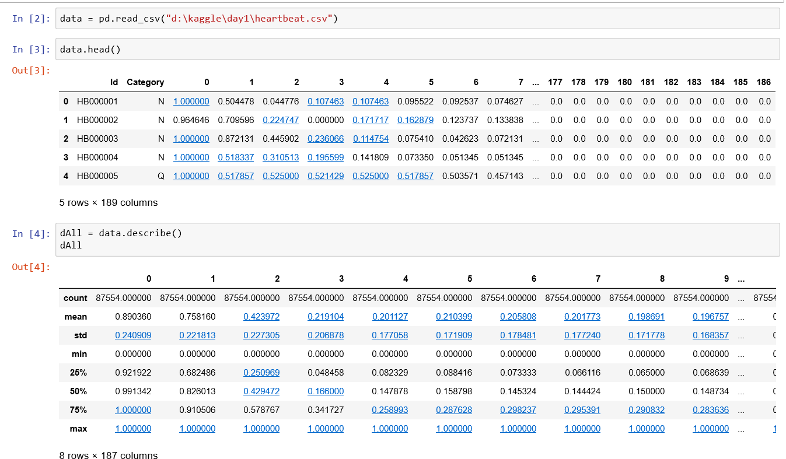
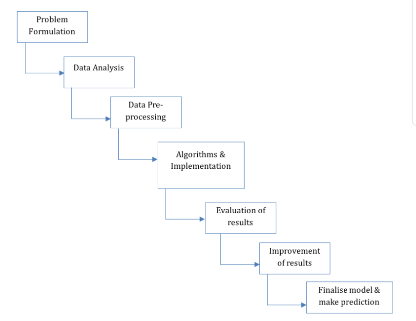
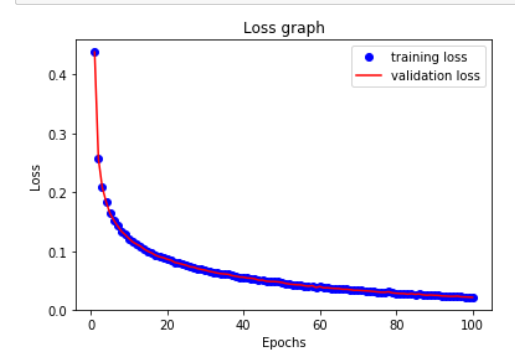
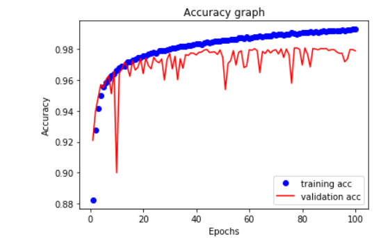
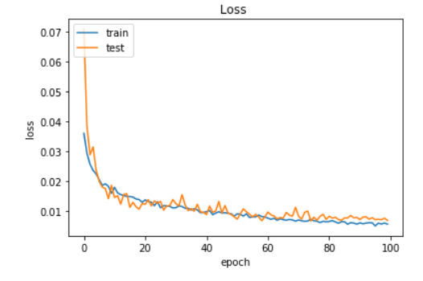
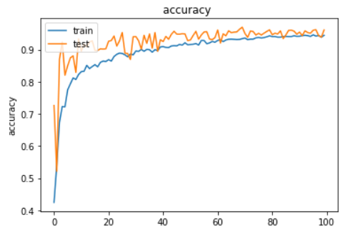
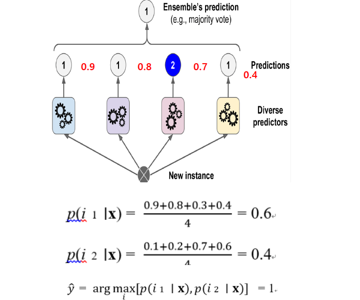
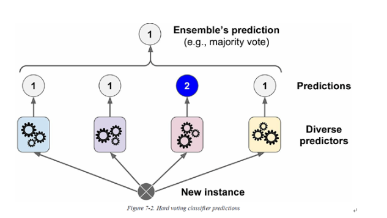

## 제공사항

1. 분류결과가 포함된 트레이닝 데이터 87,554건 - csv형식

<p align="center">
    
</p>

1. 분류결과가 포함되지 않은 테스트 데이터 21,892건

1. 테스트 데이터를 예측하여 업로드하였을때 10%의 샘플링에 대한 정확도 - kaggle 활용


<p align="center">
    
</p>

###### 목표

주어진 feature와 분류라벨을 활용하여 가장 정확도가 높은 heartbeat 분류모델을 만드는 것


### 예측모델링순서 
<p align="center">
    
</p>


### 1차 ML 을 통한 분류 시도 

```python
model = models.Sequential()
model.add(layers.Dense(128, activation='relu', input_shape=(140,)))
# model.add(layers.Dropout(0.5))
model.add(layers.Dense(64, activation='relu'))
# model.add(layers.Dropout(0.5))
# model.add(layers.Dense(32,  kernel_regularizer=regularizers.l1_l2(l1=0.001, l2=0.001), activation='relu'))
model.add(layers.Dense(32, activation='relu'))
# model.add(layers.Dropout(0.5))
model.add(layers.Dense(5, activation='softmax'))

model.compile(optimizer=RMSprop(lr=1e-3), loss='categorical_crossentropy', metrics=['accuracy'])

```

<p align="center">
    
</p>

<p align="center">
    
</p>

단순한 네트워크로 구현하였음에도 97%라는 상당히 높은 정확도를 보임. (트레이닝/테스트 스플릿 20%)
이러다 99% 찍는것 아닌지 행복한 상상을 시작함

### 2차 CNN 을 통한 분류 시도 - LeNet

```python

x = data.iloc[:, :144]
Y = data.iloc[:, -5:]

x_test = np.array(test_x).reshape((-1,12,12,1))

model=Sequential()
model.add(layers.Conv2D(32, padding="same", kernel_size=3, activation='relu', input_shape=(12,12,1)))
model.add(layers.BatchNormalization(axis=-1))
model.add(layers.MaxPool2D(pool_size=2))
model.add(layers.Dropout(0.25))
model.add(layers.Conv2D(64, padding="same", kernel_size=3, activation='relu'))
model.add(layers.BatchNormalization(axis=-1))
#         model.add(layers.MaxPool2D(pool_size=2, strides=(1,1)))
model.add(layers.Conv2D(64, padding="same", kernel_size=3, activation='relu'))
model.add(layers.BatchNormalization(axis=-1))
model.add(layers.MaxPool2D(pool_size=2))
model.add(layers.Dropout(0.25))
model.add(layers.Conv2D(128, padding="same", kernel_size=3, activation='relu'))
model.add(layers.BatchNormalization(axis=-1))
model.add(layers.Conv2D(128, padding="same", kernel_size=3, activation='relu'))
model.add(layers.BatchNormalization(axis=-1))
model.add(layers.MaxPool2D(pool_size=2))
model.add(layers.Dropout(0.25))
model.add(layers.Flatten())
model.add(layers.Dense(1024, activation='relu'))
model.add(layers.BatchNormalization())
model.add(layers.Dropout(0.5))
model.add(layers.Dense(5, activation='softmax'))
```

feature중에 의미가 없을 것이라 생각한 데이터를 일부 제외하고 12 X 12 형태의 이미지로 데이터를 변경 (트레이닝/테스트 스플릿 20%)
우여곡절이 있었으나 98% 정확도에 도달
이제는 곧 완전한 모델이 나올것이라는 기대를 갖게됨

### 3차 CNN 을 통한 분류 시도 - LeNet

```python

x = data.iloc[:, :169]
Y = data.iloc[:, -5:]

model=Sequential()
model.add(layers.Conv2D(32, padding="same", kernel_size=3, activation='relu', input_shape=(13,13,1)))
model.add(layers.BatchNormalization(axis=-1))
model.add(layers.MaxPool2D(pool_size=2))
model.add(layers.Dropout(0.25))
model.add(layers.Conv2D(64, padding="same", kernel_size=3, activation='relu'))
model.add(layers.BatchNormalization(axis=-1))
model.add(layers.Conv2D(64, padding="same", kernel_size=3, activation='relu'))
model.add(layers.BatchNormalization(axis=-1))
model.add(layers.MaxPool2D(pool_size=2))
model.add(layers.Dropout(0.25))
model.add(layers.Conv2D(128, padding="same", kernel_size=3, activation='relu'))
model.add(layers.BatchNormalization(axis=-1))
model.add(layers.Conv2D(128, padding="same", kernel_size=3, activation='relu'))
model.add(layers.BatchNormalization(axis=-1))
model.add(layers.MaxPool2D(pool_size=2))
model.add(layers.Dropout(0.25))
model.add(layers.Flatten())
model.add(layers.Dense(512, activation='relu'))
model.add(layers.BatchNormalization())
model.add(layers.Dropout(0.5))
model.add(layers.Dense(5, activation='sigmoid'))

```


<p align="center">
    
</p>

<p align="center">
    
</p>

제외하였던 데이터를 포함하고 부족한 부분은 zero-padding하여 13 X 13 형태의 이미지로 데이터를 변경 (트레이닝/테스트 스플릿 20%)
여전히 97~98%를 벗어나지 못함
뭔가 심상치 않아지기 시작


### 4차 CNN 을 통한 분류 시도 - LeNet

```python

from keras.optimizers import SGD      #optimizer=SGD(lr=0.01, momentum=0.9, nesterov=True), 
from keras.optimizers import Adam     #optimizer=Adam(lr=0.001, beta_1=0.9, beta_2=0.999)
from keras.optimizers import Adadelta #optimizer=Adadelta(rho=0.95)
from keras.optimizers import RMSprop  #optimizer=RMSprop(lr=0.001)

```

이미지 사이즈는 다시 12 X 12로 복귀. 별 차이를 못느꼈기 때문이었음 (트레이닝/테스트 스플릿 20%)
효과 없음..

1. 트레이닝 시킬때 배치 사이즈 조절 100 -> 30
1. optimizer 변경 적용 시작  (loss function: categorical_crossentropy)
   optimizer:
   - rmsprop : lr=0.001, decay=1e-4
   - Adam   : lr=0.001, beta_1=0.9, beta_2=0.999
   - Adadelta : rho=0.95
   
### 5차 CNN 을 통한 분류 시도 - LeNet

```python

model.compile(loss='binary_crossentropy', optimizer=SGD(lr=0.01, momentum=0.9, nesterov=True), metrics=['accuracy'])

```
1. loss function 변경: binary_crossentropy  
   optimizer:
   - SGD : lr=0.01, momentum=0.9, nesterov=True

갑작스런 99%를 로컬에서 경험하였으나, 실제 적용시 97%에도 못미치는 정확도를 보임

### 6차 CNN 을 통한 분류 시도 - LeNet 

```python
class_weight = {0: 0.67,
                1: 0.01,
                2: 0.06,
                3: 0.07,
                4: 0.19}  # ['F','N','Q','S','V']

history = model.fit(allx, ally, validation_split=0.2, batch_size=100, epochs=100, class_weight=class_weight, verbose=1, callbacks=[cb_checkpoint])
```
테스트 데이터들간에 비율이 다른것을 확인
가중치를 부여하기 시작함=> 큰차이는 나지 않음

### 7차 CNN 을 통한 분류 시도 - LeNet 

```python

 # train / test split
train = pd.concat([data[data.Category=='N'].iloc[:-100,:], data[data.Category=='Q'].iloc[:-100,:], data[data.Category=='V'].iloc[:-100,:], data[data.Category=='F'].iloc[:-100,:], data[data.Category=='S'].iloc[:-100,:] ])
test =pd.concat([data[data.Category=='N'].iloc[-100:,:], data[data.Category=='Q'].iloc[-100:,:], data[data.Category=='V'].iloc[-100:,:], data[data.Category=='F'].iloc[-100:,:], data[data.Category=='S'].iloc[-100:,:] ])

#random
train = train.sample(frac=1).reset_index(drop=True)
test = test.sample(frac=1).reset_index(drop=True)

```
validation 데이터를 각 100건씩으로 동일수로 추출하고 
나머지 데이터들의 비율 고려하여 가중치 재 적용 => 오히려 학습률이 감소

### 8차 CNN 을 통한 분류 시도 - Vgg19 , ResNet

```python

model=Sequential()
model.add(layers.Conv2D(64, padding="same", kernel_size=3, activation='relu', input_shape=input_shape))
model.add(layers.Conv2D(64, padding="same", kernel_size=3, activation='relu'))
#         model.add(layers.BatchNormalization(axis=-1))
model.add(layers.MaxPool2D(pool_size=2, strides=2))# dim_ordering="tf" or "th" #tensorflow vs theano

model.add(layers.Conv2D(128, padding="same", kernel_size=3, activation='relu'))        
model.add(layers.Conv2D(128, padding="same", kernel_size=3, activation='relu'))        
#         model.add(layers.BatchNormalization(axis=-1))
model.add(layers.MaxPool2D(pool_size=2, strides=2))
#         model.add(layers.Dropout(0.25))

model.add(layers.Conv2D(256, padding="same", kernel_size=3, activation='relu'))
model.add(layers.Conv2D(256, padding="same", kernel_size=3, activation='relu'))
#         model.add(layers.BatchNormalization(axis=-1))
model.add(layers.MaxPool2D(pool_size=2, strides=2))
#         model.add(layers.Dropout(0.25))

model.add(layers.Conv2D(512, padding="same", kernel_size=3, activation='relu'))
model.add(layers.Conv2D(512, padding="same", kernel_size=3, activation='relu'))
model.add(layers.Conv2D(512, padding="same", kernel_size=3, activation='relu'))
model.add(layers.Conv2D(512, padding="same", kernel_size=3, activation='relu'))
#         model.add(layers.BatchNormalization(axis=-1))
model.add(layers.MaxPool2D(pool_size=2, strides=2))

model.add(layers.Conv2D(512, padding="same", kernel_size=3, activation='relu'))
model.add(layers.Conv2D(512, padding="same", kernel_size=3, activation='relu'))
model.add(layers.Conv2D(512, padding="same", kernel_size=3, activation='relu'))
model.add(layers.Conv2D(512, padding="same", kernel_size=3, activation='relu'))
#         model.add(layers.BatchNormalization(axis=-1))
model.add(layers.MaxPool2D(pool_size=2, strides=2))

model.add(layers.Flatten())
model.add(layers.Dense(2048, activation='relu'))
model.add(layers.Dense(2048, activation='relu'))
model.add(layers.Dense(500, activation='relu'))
#         model.add(layers.BatchNormalization())

model.add(layers.Dense(5, activation='softmax'))


```

네트워크 모델을 변경하여 가며 테스트 시작=> 여전히 변화를 보이지 않음. 정확도는 95~98%까지 떨어짐

### 9차 ML을 통한 분류 시도

Randomforest 등 ML 로 분류시도 = > 98은 넘어서지 못함

그러다 어느새 종료..


#### 패착

1. 데이터를 임의로 제거하고 12 x 12로 테스트 한점
1. validation data split 을 너무 과도하게 잡은것 => 10% 미만으로 할걸!
1. 네트워크를 너무 복잡하게 설계한것 => nn으로도 97% 이 나오는데;
1. 각 모델들을 버리고 계속해서 새로운 모델로 학습한것. => ensemble 의 soft-vote를 적용해보았다면?

## soft-vote vs hard-vote
<p align="center">
    
</p>

<p align="center">
    
</p>


[메인으로 돌아가기](./)
